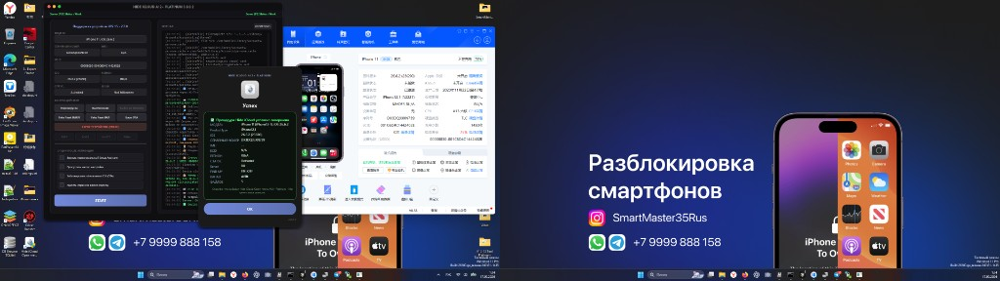
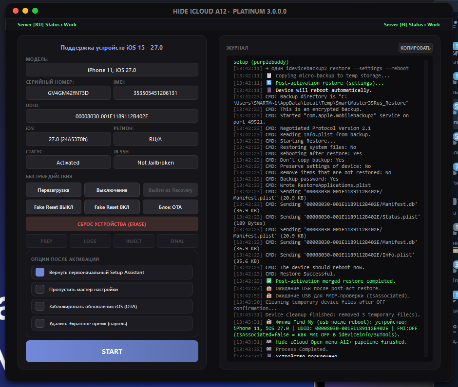
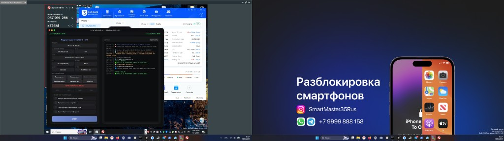

# Hide iCloud Open menu A12+ Platinum

**Service toolkit for Apple A12+ devices on Windows**

[](https://github.com/smartmaster35rus-dev/Hide-iCloud-A12-Platinum-win/releases/latest)
[](https://github.com/smartmaster35rus-dev/Hide-iCloud-A12-Platinum-win/releases)
[](https://smartmaster35rus-activator.ru/)

<p align="center">

[⬇️ Download latest release](https://github.com/smartmaster35rus-dev/Hide-iCloud-A12-Platinum-win/releases/latest) · [📋 Supported models](https://smartmaster35rus-activator.ru/compatible.php) · [🌐 Activator site](https://smartmaster35rus-activator.ru/)

</p>

<p align="center">
  
</p>

---

## 🇷🇺 О программе

**Hide iCloud Open menu A12+ Platinum** — Windows-приложение для сервисных процедур на iPhone и iPad с чипами **Apple A12 и новее**: подготовка устройства, доставка конфигурации с сервера, настройка после активации, live-журнал и интерфейс Platinum.

Поддерживаются актуальные версии iOS, включая **26.2–27.0.beta4**. Для более ранних билдов доступны проверенные сценарии доставки из предыдущих веток продукта.

## 🇬🇧 About

**Hide iCloud Open menu A12+ Platinum** is a Windows desktop app for **Apple A12+** service workflows: device preparation, server-side configuration delivery, post-activation options, live log, Platinum UI.

Supports current iOS releases including **26.2–27.0.beta4**, with legacy delivery paths for older builds.

---

## 📸 Screenshots

| Main window · device connected | Post-activation options & live log |
|:---:|:---:|
|  |  |

| Success / completion dialog |
|:---:|
|  |

---

## ✨ Key features

| Feature | Description |
|---------|-------------|
| 📱 **Modern iOS (26.2+)** | Обновлённый канал доставки конфигурации для новых версий системы |
| 🔄 **Classic delivery** | Проверенные сценарии для iOS до 26.2 |
| 🎯 **Post-activation** | Один шаг восстановления настроек после основной процедуры |
| 👋 **Setup Assistant** | Вернуть или пропустить мастер первоначальной настройки |
| 🚫 **OTA control** | Опция ограничения обновлений iOS |
| ⏱️ **Screen Time** | Опция сброса настроек «Экранного времени» |
| 🌐 **Online** | Работа с activation server, проверка устройства |
| 🌍 **i18n** | Русский · English · Español |

---

## ⬇️ Download

Перейдите в **[Releases](https://github.com/smartmaster35rus-dev/Hide-iCloud-A12-Platinum-win/releases/latest)**:

| File | Purpose |
|------|---------|
| `hide_icloud_open_menu_a12_platinum_X.X.X.X.exe` | Portable (без установки) |
| `hide_icloud_open_menu_a12_platinum_setup.exe` | Установщик Inno Setup |

> ⚠️ Запуск **от имени администратора**. Нужен USB-кабель и драйвер Apple Mobile Device.

### Как публиковать новый релиз (для maintainer)

GitHub **не подхватывает** exe из папки `dist/` автоматически — релиз создаётся вручную или тегом:

```powershell
# после сборки nutika_build.bat
gh release create v3.0.0.2 dist\hide_icloud_open_menu_a12_platinum_3.0.0.2.exe dist\hide_icloud_open_menu_a12_platinum_setup.exe --title "Hide iCloud Open menu A12+ Platinum v3.0.0.2" --notes-file RELEASE_3.0.0.2.md
```

Тег лучше в формате **`v3.0.0.2`** (без точки после `v`), чтобы badge и «Latest release» отображались корректно.

---

## 📋 Requirements

- **ОС:** Windows 10 / 11 (64-bit)
- **USB:** стабильный кабель, usbmuxd / Apple USB driver
- **Устройства:** iPhone/iPad **A12+** из [списка поддержки](https://smartmaster35rus-activator.ru/compatible.php)
- **Сеть:** интернет для activation server
- **Режим разработчика:** может потребоваться на части версий iOS; на **26.2+** для нового канала доставки **не обязателен**
- **Перед post-activation:** устройство должно быть готово к восстановлению настроек (см. подсказки в приложении)

---

## 🔗 Related links

| Resource | URL |
|----------|-----|
| Activator / support | [smartmaster35rus-activator.ru](https://smartmaster35rus-activator.ru/compatible.php) |
| Ramdisk toolkit (A12–A13) | [A12-13-Ramdisk-Erase-tool-Platinum-win](https://github.com/smartmaster35rus-dev/A12-13-Ramdisk-Erase-tool-Platinum-win) |

---

## 📝 Changelog

Полные заметки — в [Releases](https://github.com/smartmaster35rus-dev/Hide-iCloud-A12-Platinum-win/releases).

**v3.0.0.2** — Developer Mode 2× для AirLift, passcode popup, UI без сжатия, cap 27.0.beta4  
**v3.0.0.1** — iOS 26.2–27, post-activation, обновлённый канал доставки  
**v2.0.0.x** — базовый Platinum UI и классические сценарии

---

## ⚖️ Disclaimer

Инструмент предназначен для **авторизованного сервиса и исследований** на устройствах, которыми вы владеете или имеете право обслуживать. Автор не несёт ответственности за неправомерное использование.

---

<p align="center">

**SmartMaster35Rus** · [smartmaster35rus-activator.ru](https://smartmaster35rus-activator.ru/compatible.php)

</p>
